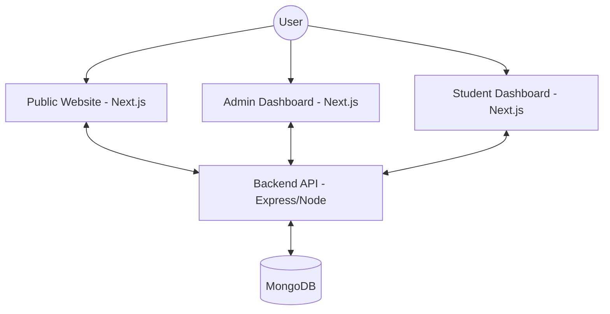
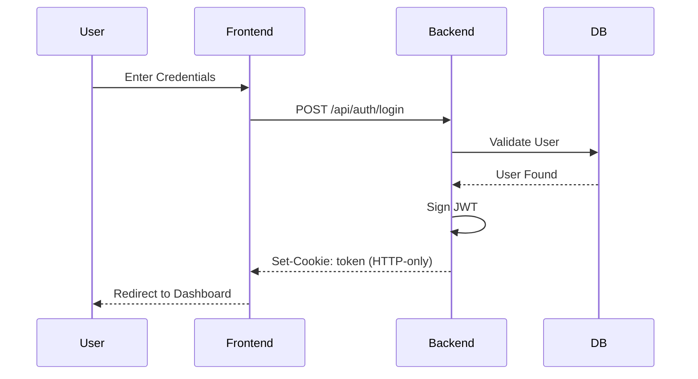

# 🏗 Technical Architecture & Deep Dive

This document provides a detailed technical breakdown of the EDUSPARK architecture, data flows, and system components.

---

## 1. System Component Diagram

---

## 2. Authentication Flow (JWT + HTTP-only Cookies)

EDUSPARK uses a stateless authentication mechanism that is both secure and scalable.

### Sequence Diagram

### Key Security Features:
- **HTTP-only Cookies**: Prevents XSS-based token theft.
- **Role-based Protection**: Backend middleware verifies the `role` field in the JWT payload.
- **Token Expiry**: Ensures sessions are not perpetual.

---

## 3. Data Integration Flow (Dynamic CMS)

The "Dynamic" nature of EDUSPARK is achieved through a centralized content management flow.

### Notice Board Example:
1. **Admin Action**: Creates a notice in the Admin Panel.
2. **Backend API**: `POST /api/notices` saves data to MongoDB.
3. **Public Fetch**: The homepage `Notices.tsx` component makes a `GET /api/notices` call.
4. **Student Fetch**: The student dashboard `Notices` widget also fetches the same data.
5. **Sync**: All interfaces update instantly.

---

## 4. Quiz & Assessment Engine

The quiz system is the most complex part of the logic, involving server-side evaluation.

### Flow:
- **Admin**: Defines questions, options, and **correctAnswer (index)**.
- **Student**: Receives the quiz data (without correct answers).
- **Evaluation**: 
    - Student submits an array of chosen indices.
    - Backend loops through the stored `correctAnswer` values and compares them to the student's input.
    - Results are stored in the `Result` model.

---

## 5. Directory Structure Mapping

### Frontend (`/src`)
- **`app/(dashboard)/admin`**: Contains pages for analytics, faculty management, gallery, notices, notes, and students.
- **`app/(dashboard)/student`**: Contains pages for dashboard, tests, and results.
- **`components/sections`**: Modular components used on the homepage to ensure high performance and reusability.
- **`store/authStore.ts`**: Uses Zustand to keep track of the logged-in user's profile globally.

### Backend (`/server`)
- **`routes/`**: Grouped by resource (e.g., `studentRoutes.ts`, `quizRoutes.ts`).
- **`controllers/`**: Logic separated from routes to maintain cleanliness.
- **`middleware/auth.ts`**: Contains `protect`, `adminOnly`, and `studentOnly` higher-order functions.

---

## 6. Development & Deployment Summary

### Local Ports:
- **Frontend**: `http://localhost:3000`
- **Backend**: `http://localhost:5002`

### Deployment Readiness:
- **Frontend**: Optimized for Vercel/Netlify.
- **Backend**: Ready for Render/Heroku.
- **Database**: Compatible with MongoDB Atlas.

---

## 7. Reusable UI System

EDUSPARK uses a custom UI kit found in `src/components/ui`:
- **Card**: Glassmorphism effect with premium shadows.
- **Button**: Hover-animated, gradient-capable buttons.
- **Navbar**: Adaptive navigation with role-based links.

---
