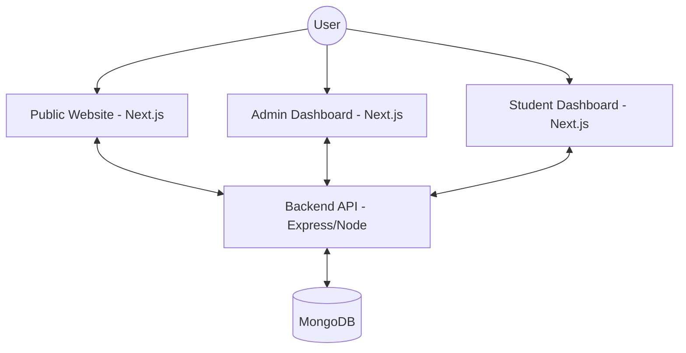
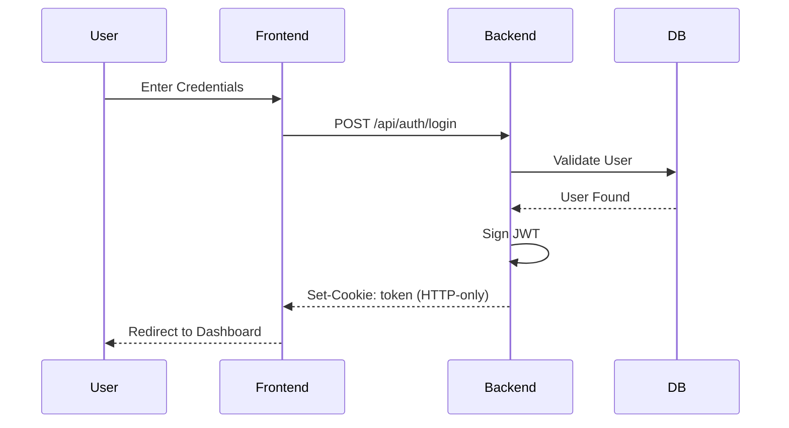

# EDUSPARK Study Center – Premium Coaching & Management Platform

EDUSPARK is a high-performance, aesthetically premium, and functionally complete management platform designed specifically for premier educational coaching institutes (IIT-JEE, NEET, and school board foundations). It decoupling a secure Next.js 16 frontend portal from an Express/MongoDB backend to enable dynamic content management, student assessments, real-time analytics, and optimized local search indexing.

---

## 🏗 Technical Architecture & Deep Dive

EDUSPARK utilizes a secure, **decoupled Client-Server architecture** using the MERN stack with modern frontend enhancements.

### System Flow


### 🔐 Authentication System (JWT + HTTP-only Cookies)
EDUSPARK implements a secure, stateless **Cookie-based JWT Authentication** flow:
1. **Login**: User submits credentials to `/api/admin/login` or `/api/student-auth/login`.
2. **Token Generation**: Backend verifies credentials, generates a JWT, and sends it as an **HTTP-only Cookie** named `token`.
3. **Middleware Protection**:
   - **Frontend**: Next.js `middleware.ts` checks for the presence of the `token` cookie before allowing access to `/(dashboard)` routes.
   - **Backend**: `protect` middleware verifies the JWT from cookies. `adminOnly` and `studentOnly` check the `role` claim in the decoded token.
4. **Logout**: Cookie is cleared from the browser.



### Key Security Features
- **HTTP-only Cookies**: Prevents XSS-based token theft.
- **Role-based Protection**: Backend middleware verifies the `role` field in the JWT payload.
- **Token Expiry**: Ensures sessions are not perpetual.

---

## 📂 Directory Structure

### 💻 Frontend Client (`/src`)
Built with **Next.js 16 (App Router)** and **Tailwind CSS v4**.

- **`/app`**: Contains all routes and page layouts.
  - `(auth)`: Grouped authentication routes (Login, Admin Login).
  - `(dashboard)`: Protected dashboard routes for both Students and Admins.
- **`/components`**: Reusable UI components and section-wise blocks.
  - `/sections`: Large homepage components (Hero, Faculty, Gallery, About, Courses).
  - `/dashboard`: Specific components for the internal portal (Sidebar, Layout).
  - `/ui`: Atomic design components (Button, Card, Input).
  - `/animations`: Global animation wrappers (Framer Motion).
- **`/store`**: State management using **Zustand** (Auth state, User info).
- **`/lib`**: Utility configurations (Axios instance with credentials).
- **`/types`**: Global TypeScript interfaces.

### ⚙️ Backend API (`/server`)
Built with **Node.js**, **Express**, and **Mongoose**.

- **`/controllers`**: Core business logic for each resource.
- **`/routes`**: API endpoint definitions.
- **`/models`**: MongoDB schemas with validation and middleware (bcrypt hooks).
- **`/middleware`**: Security layers (JWT verification, Role-based access control).
- **`/config`**: Database and environment configurations.

---

## 📊 Database Models (MongoDB)

| Model | Description | Key Fields |
|-------|-------------|------------|
| **Admin** | Superuser accounts | `name`, `email`, `password`, `role` |
| **Student** | Student accounts | `fullName`, `username`, `class`, `status`, `role`, `enrolledCourses[]` |
| **Faculty** | Institute teachers | `name`, `subject`, `qualifications[]`, `experience`, `imageUrl` |
| **Gallery** | Campus highlights | `imageUrl`, `caption` |
| **Notice** | Announcements | `title`, `content`, `isImportant`, `createdAt` |
| **Quiz** | Assessments | `title`, `subject`, `questions[]`, `duration`, `published` |
| **Result** | Student performance | `studentId`, `quizId`, `score`, `percentage` |
| **Note** | Study material | `title`, `category`, `fileUrl` |

---

## 🛠 Features Summary

1. **Dual Portal Panel**: Separate, styled administrative panel (CMS and student registration) and student dashboard.
2. **Interactive Assessment Engine**: Timer, server-side secure evaluations, results dashboard, and leaderboard calculations.
3. **Dynamic CMS Integration**: Real-time updates to public Faculty listings, Notice boards, and Gallery pages via Axios APIs.
4. **Local Business SEO & JSON-LD**: Concentrated local keyword integration, Canonical metadata hooks, and robust sitemap indexing schemas.
5. **Brand Integrity**: Custom-scaled navbar branding vectors, automated favicon resolution pipelines, and tap animations.

---

## 🚀 Setup & Installation

### Prerequisites
- Node.js (v18+)
- MongoDB (Local or Atlas)

### Environment Variables (`.env`)
Create a `.env` file in the root backend `/server` folder:
```env
PORT=5002
MONGO_URI=your_mongodb_connection_string
JWT_SECRET=your_secure_jwt_secret_phrase
```

Create a `.env.local` file in the frontend root folder:
```env
NEXT_PUBLIC_WEB3FORMS_KEY=your_web3forms_access_key
```

### Local Development Commands
1. **Initialize and Seed Backend**:
   ```bash
   cd server
   npm install
   npm run seed  # CRITICAL: Seeds initial admin credentials
   npm run dev   # Runs API on http://localhost:5002
   ```
2. **Launch Frontend Client**:
   ```bash
   # In a new terminal window at the project root
   npm install
   npm run dev   # Runs App on http://localhost:3000
   ```

---

## 🛠 API Endpoints Documentation

**Base API URL**: `http://localhost:5002/api`

### 🔐 Authentication
- `POST /admin/login` - Admin Login. Expects `{ email, password }`. Sets `token` cookie.
- `POST /student-auth/login` - Student Login. Expects `{ username, password }`. Sets `token` cookie.

### 👨‍🏫 Faculty Management
- `GET /faculty` - Public. Returns list of all faculty members.
- `POST /faculty` - Admin Only. Registers a new teacher.
- `DELETE /faculty/:id` - Admin Only. Removes a teacher profile.

### 🖼 Gallery Management
- `GET /gallery` - Public. Returns campus highlights.
- `POST /gallery` - Admin Only. Uploads a gallery asset.
- `DELETE /gallery/:id` - Admin Only. Removes a gallery asset.

### 📢 Notice Announcements
- `GET /notices` - Public. Fetches active notices.
- `POST /notices` - Admin Only. Creates a notice announcement.
- `DELETE /notices/:id` - Admin Only. Deletes a notice.

### 📚 Assessments & Quizzes
- `GET /quizzes` - Student/Admin. Returns quizzes. (Students only see published tests).
- `POST /quizzes` - Admin Only. Compiles a new quiz.
- `GET /quizzes/:id` - Fetches specific quiz questions.
- `PATCH /quizzes/:id` - Admin Only. Publishes or updates quiz details.
- `DELETE /quizzes/:id` - Admin Only. Deletes a quiz.

### 📊 Results & Telemetry
- `POST /results` - Student Only. Submits answers for server-side evaluation.
- `GET /results/student` - Student Only. Returns logged-in student's historical results.
- `GET /analytics/overview` - Admin Only. Returns institute-wide success rates.
- `GET /analytics/leaderboard` - Returns top student scoring profiles.

---

## 🚀 Production Launch & Vercel Deployment

EDUSPARK is engineered for rapid, stateless deployment on Vercel:

### 1. Push to Remote Repository
Push your local directory to a private GitHub repository:
```bash
git init
git add .
git commit -m "chore: production launch release candidate"
git branch -M main
git remote add origin git@github.com:YOUR_USERNAME/edusparksheoganj.git
git push -u origin main
```

### 2. Configure Vercel Project
1. Log in to [vercel.com](https://vercel.com).
2. Click **Add New** > **Project** and import your repository.
3. In the **Environment Variables** section, add your Web3Forms token:
   - **Key**: `NEXT_PUBLIC_WEB3FORMS_KEY`
   - **Value**: `YOUR_WEB3FORMS_ACCESS_KEY`
4. Click **Deploy**. Vercel compiles the Next.js bundle and publishes it to global edge CDNs.

### 3. DNS Custom Domain Mapping
1. Go to Vercel **Settings** > **Domains**.
2. Input `edusparksheoganj.in` (and `www.edusparksheoganj.in`) and click **Add**.
3. Configure the following DNS values with your domain registrar:
   - **Apex Domain (`edusparksheoganj.in`)**: Add an `A` record pointing to `76.76.21.21`.
   - **Subdomain (`www.edusparksheoganj.in`)**: Add a `CNAME` record pointing to `cname.vercel-dns.com`.
4. Wait 5–15 minutes for the Let's Encrypt SSL certificate to auto-provision.

---

## 🚦 Pre-Flight Quality Assurance

Prior to mapping live domains, verify these core indicators:

- **Type Safety**: Run `npx tsc --noEmit` to ensure 0 TypeScript compilation errors.
- **Production Build**: Verify static page optimization via `npm run build`.
- **Linter Checks**: Run `npm run lint` to verify eslint compliance.
- **Responsive Layouts**: Double-check responsive timeline structures, safe-area button overlays, and container margins.
- **Local Integrations**: Confirm Web3Forms leads compile correctly, directions route cleanly to `Krishna Prime Complex, Sheoganj`, and sitemaps parse successfully.

---
*Created with ❤️ for EDUSPARK Educational Institutes.*
